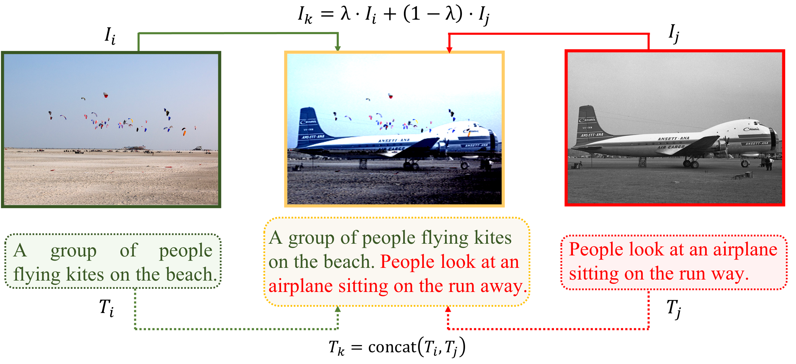

## MixGen: A New Multi-Modal Data Augmentation

This is the official PyTorch implementation of [MixGen](https://arxiv.org/abs/2206.08358), which is a joint data augmentation technique for vision-language representation learning to improve data efficiency.



Here are some image-text pairs generated by MixGen,


## How to use

MixGen is an input-level data augmentation technique, which can be plugged-and-played into existing vision-language learning methods with minimal code change.

Here we adopt [ALBEF, NeurIPS'21](https://arxiv.org/abs/2107.07651) as an illustrating example. We only need to add one line between dataloader and model forward [here](https://github.com/salesforce/ALBEF/blob/main/Pretrain.py#L54).

That is, change from

```
for i, (image, text) in enumerate(metric_logger.log_every(data_loader, print_freq, header)):
    optimizer.zero_grad()
```

to
```
import mixgen as mg
for i, (image, text) in enumerate(metric_logger.log_every(data_loader, print_freq, header)):
    image, text = mg.mixgen(image, text, num=16)
    optimizer.zero_grad()
```

And that's it!!! No more changes needed to be made. You can simply kicoff training just like ALBEF does,


```
python -m torch.distributed.launch --nproc_per_node=8 --use_env Pretrain.py
```


## Security

See [CONTRIBUTING](CONTRIBUTING.md#security-issue-notifications) for more information.

## License

This project is licensed under the Apache-2.0 License.

